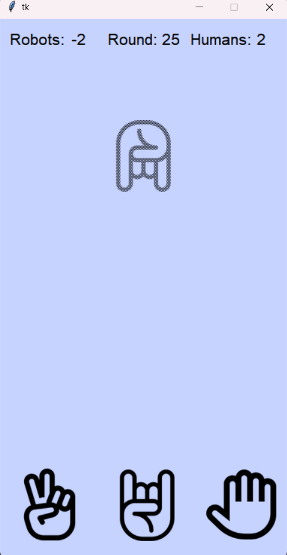

# Rock Paper Scissors

This is a simple rock paper scissors game with a GUI.
There are 3 states: rock, paper and scissors. 
The opponent will try to predict your next move based on your previous moves and 
update transition probability accordingly.

## Rules
This is traditional rock paper scissors game witch ends:
- when one of the players reaches 10 points
- when number of rounds reaches 30

You can get a point by winning a round and lose a point by losing a round.

## How to run
Preferably use PyCharm to avoid unexpected behaviour, although it should work in virtual environment as well.

1. Clone the repository
2. Open the project in PyCharm
3. Run the `main.py` file
4. Defend the honor of humanity!